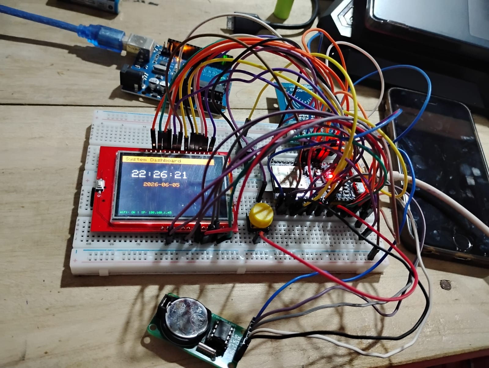
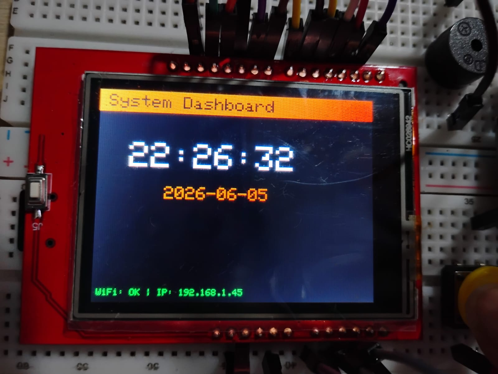
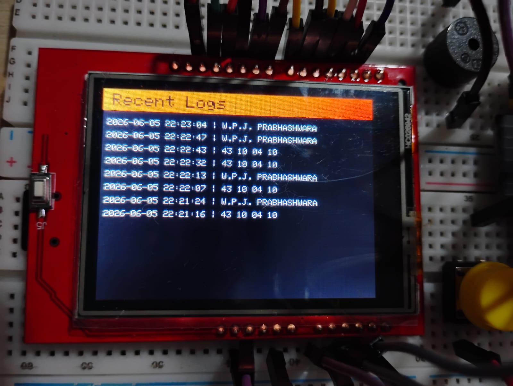
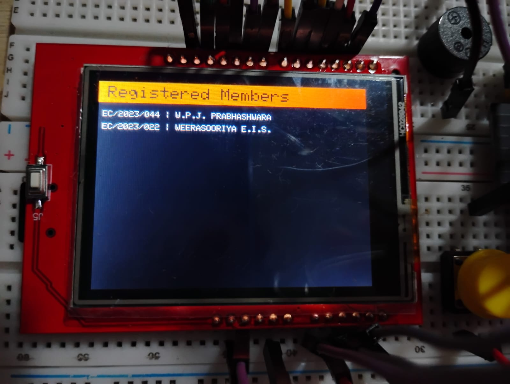

# ESP32 RFID Door System Prototype

This repository contains the prototype code for an ESP32-based RFID Door Access System. It features local SQLite database storage via an SD card, a TFT display for the user interface, an RTC module for accurate timekeeping, and a Flask-based web application for remote management.

## Features
- **RFID Access Control:** Scans RFID cards/tags using the MFRC522 reader.
- **Onboard Database:** Uses SQLite to store member details and access logs directly on an SD card.
- **TFT Display UI:** Real-time dashboard showing time, Wi-Fi status, scan results, recent logs, and registered members.
- **Web Interface:** A Flask web app to remotely view logs, add/remove members, and reset the database via HTTP requests to the ESP32.
- **Audible & Visual Feedback:** Includes a buzzer and color-coded display feedback for successful/failed scans.

## Hardware Components
- ESP32 Microcontroller
- MFRC522 RFID Reader
- TFT Display (using TFT_eSPI library)
- DS1302 RTC (Real Time Clock) Module
- SD Card Module (for SQLite database storage)
- Buzzer & Push Button

## Project Structure
- `Code For S3/sketch_jun5a.ino`: The main Arduino sketch for the ESP32. It handles RFID scanning, the TFT UI, SQLite database operations, and runs a local web server.
- `Web App/`: Contains the Flask Python web application (`app.py` and templates). This app acts as a remote dashboard to interact with the ESP32 over the local network.
- `images/`: Contains prototype images and hardware setup pictures.

## Prototype Images

Here are some images of the prototype:






## Getting Started

### 1. ESP32 Setup
1. Open `Code For S3/sketch_jun5a.ino` in the Arduino IDE.
2. Install the required libraries (`MFRC522`, `TFT_eSPI`, `ThreeWire`, `RtcDS1302`, `SD`, `sqlite3`).
3. Update the Wi-Fi credentials in the code:
   ```cpp
   const char* ssid = "YOUR_SSID";
   const char* password = "YOUR_PASSWORD";
   ```
4. Flash the code to your ESP32.
5. Once booted, the ESP32 display will show its IP address.

### 2. Web App Setup
1. Navigate to the `Web App` directory.
2. Ensure you have Python and Flask installed (`pip install flask requests`).
3. Open `app.py` and update the `ESP32_IP` variable with the IP address shown on your ESP32 display:
   ```python
   ESP32_IP = "http://YOUR_ESP32_IP" 
   ```
4. Run the Flask application:
   ```bash
   python app.py
   ```
5. Open your web browser and go to `http://localhost:5000` to manage the system.
